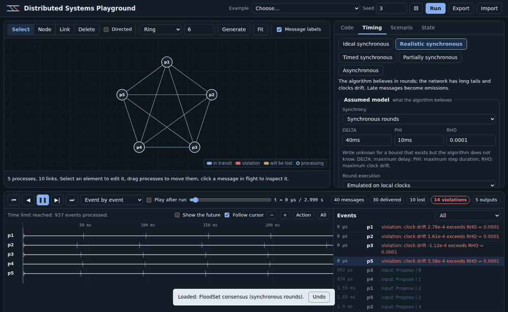
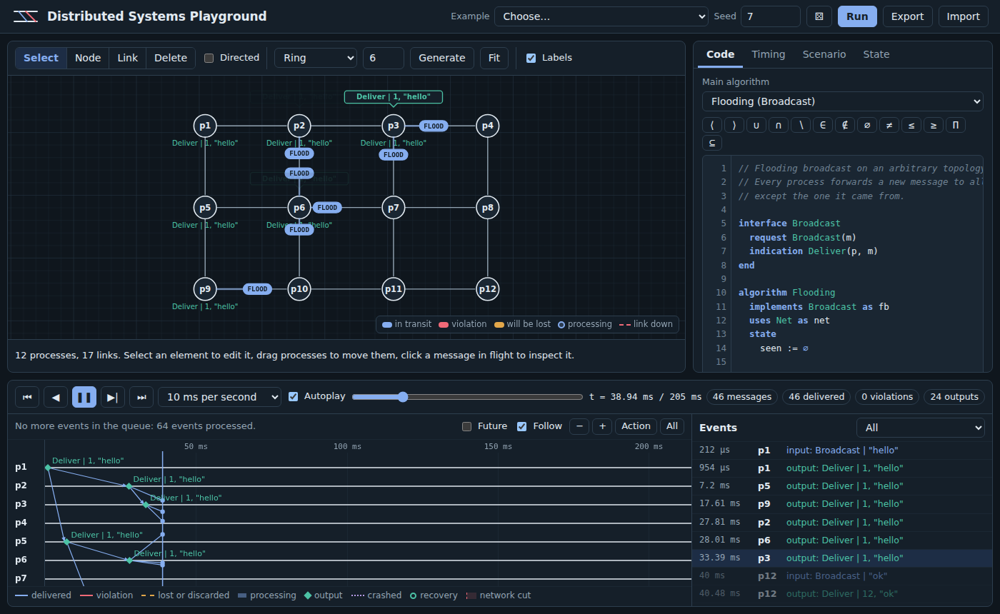

<div align="center">

<picture>
  <source media="(prefers-color-scheme: dark)" srcset="docs/assets/banner-dark.svg">
  
</picture>

# Distributed Systems Playground

**Watch distributed algorithms run, message by message, on the network you actually have.**

[](https://github.com/engineering87/distributed-systems-playground/actions/workflows/ci.yml)
[](LICENSE)

[](https://engineering87.github.io/distributed-systems-playground/)

[Live demo](https://engineering87.github.io/distributed-systems-playground/) · [Documentation site](https://engineering87.github.io/distributed-systems-playground/manual/) · [Getting started](docs/getting-started.md) · [Assumptions](docs/assumptions.md) · [Changelog](CHANGELOG.md)


</div>

Distributed Systems Playground is a browser-based environment for writing, running and observing distributed algorithms. You draw a network of processes, write an algorithm in the event-driven pseudocode used by the standard textbooks, and watch every message travel, arrive, get lost or arrive too late.

Its distinguishing idea is that the timing model the algorithm *assumes* and the way the network *actually behaves* are configured separately. Most algorithms are proved correct under assumptions that real networks do not honor. Here you can hold the assumptions fixed, change the network underneath, and see the exact message that breaks the algorithm.

Everything runs in the browser from a single HTML file. There is no server to deploy and nothing to install.

<table>
  <tr>
    <td width="50%"><br><sub><b>Stack view.</b> Requests go down, indications come up, messages are colored by the module that sent them.</sub></td>
    <td width="50%"><br><sub><b>Causality.</b> Click an event to shade what could have caused it and what it could affect.</sub></td>
  </tr>
  <tr>
    <td width="50%"><br><sub><b>Presentation mode.</b> Large text, no side panel, a clicker steps through events.</sub></td>
    <td width="50%"><br><sub><b>Example gallery.</b> Classic algorithms, each with experiments to try.</sub></td>
  </tr>
</table>

## Table of contents

- [Why distributed systems are hard](#why-distributed-systems-are-hard)
  - [No shared memory, no shared clock](#no-shared-memory-no-shared-clock)
  - [Partial failures](#partial-failures)
  - [Timing models](#timing-models)
  - [Layers of abstraction](#layers-of-abstraction)
  - [The gap between the model and the network](#the-gap-between-the-model-and-the-network)
- [What the playground is for](#what-the-playground-is-for)
- [Features](#features)
- [Quick start](#quick-start)
- [Algorithms you can run](#algorithms-you-can-run)
- [Documentation](#documentation)
- [A guided tour](#a-guided-tour)
  - [1. Flooding on a grid](#1-flooding-on-a-grid)
  - [2. When synchrony is only an assumption](#2-when-synchrony-is-only-an-assumption)
  - [3. Detecting failures without a clock you can trust](#3-detecting-failures-without-a-clock-you-can-trust)
  - [4. Splitting the network](#4-splitting-the-network)
  - [5. Changing what happened](#5-changing-what-happened)
  - [6. Following events through the stack](#6-following-events-through-the-stack)
  - [7. Asking what caused what](#7-asking-what-caused-what)
- [Core concepts](#core-concepts)
- [The Upon language](#the-upon-language)
- [The module library](#the-module-library)
- [Timing model reference](#timing-model-reference)
- [Faults](#faults)
- [Scenarios](#scenarios)
- [The interface](#the-interface)
- [Included examples](#included-examples)
- [How it works](#how-it-works)
- [Development](#development)
- [Assumptions and limitations](#assumptions-and-limitations)
- [Roadmap](#roadmap)
- [Related tools](#related-tools)
- [FAQ](#faq)
- [Contributing](#contributing)
- [References](#references)
- [License](#license)

## Why distributed systems are hard

A distributed system is a set of independent processes that cooperate by exchanging messages. Databases that replicate data across data centers, payment networks, container orchestrators, blockchains and the services behind any large website are all distributed systems. They are built this way for fault tolerance, scale and geography, and they pay for it with a set of problems that do not exist on a single machine.

### No shared memory, no shared clock

Processes do not share memory. The only way for one process to learn something about another is to receive a message from it, and by the time the message arrives, the sender may have changed its state, or stopped.

There is also no global clock. Each machine has its own oscillator, clocks drift apart, and synchronization protocols can only bound the error, not remove it. Leslie Lamport showed in 1978 that the meaningful notion of time in such a system is causal: an event *happened before* another only if information could have flowed from the first to the second. A **space-time diagram**, with one horizontal line per process and one arrow per message, is the standard way to draw this relation, and it is the main view of this playground.

### Partial failures

On a single computer, a failure usually stops everything. In a distributed system, some processes fail while others keep running, and the survivors have to decide what to do without knowing exactly what happened. The literature classifies failures by how badly a process can misbehave:

| Failure model | What a faulty process can do |
|---|---|
| Crash-stop | stop at an arbitrary moment and never come back |
| Crash-recovery | stop and later restart, possibly losing volatile state |
| Omission | fail to send or receive some messages |
| Byzantine | behave arbitrarily, including lying or colluding |

Channels fail too. Messages can be lost, duplicated, reordered or delayed, and a link can fail while both endpoints keep working. A slow process and a crashed one look identical from the outside, which is the root of most of the difficulty.

### Timing models

What an algorithm can achieve depends heavily on what it may assume about time:

- **Synchronous.** There are known bounds on message delay, on processing time and on clock drift. Algorithms can proceed in rounds and treat a missing message as proof of failure.
- **Asynchronous.** There are no bounds at all. This is the weakest and safest assumption, but Fischer, Lynch and Paterson proved in 1985 that no deterministic algorithm can guarantee consensus in this model if even one process may crash (the FLP impossibility result).
- **Partially synchronous.** Bounds exist but are unknown, or hold only after some unknown Global Stabilization Time (GST). Dwork, Lynch and Stockmeyer introduced this model in 1988, and practical consensus protocols such as Paxos and Raft are designed for it: they are always safe, and they make progress once the network behaves.

Unreliable **failure detectors**, introduced by Chandra and Toueg, package these timing assumptions into an abstraction. An *eventually perfect* detector may suspect correct processes for a while, but eventually suspects exactly the crashed ones.

### Layers of abstraction

Textbooks, most notably *Introduction to Reliable and Secure Distributed Programming* by Cachin, Guerraoui and Rodrigues, build distributed algorithms as stacks of modules. A perfect link is built on a lossy link, a reliable broadcast on perfect links, a failure detector on timers and links, and consensus on top of broadcast and failure detection. Each module reacts to events from the layers around it:

```
upon event ⟨pl, Deliver | p, m⟩ do
  trigger ⟨beb, Deliver | p, m⟩
end
```

This notation is precise enough to reason about and close enough to code that it can be executed. The playground executes it.

### The gap between the model and the network

Proofs hold under their assumptions. When a course states that FloodSet solves consensus in f + 1 synchronous rounds, the statement is correct, and it is also silent about what happens when a round-2 message arrives 5 milliseconds after the round closed. Real networks have long-tailed latency, sporadic spikes, drifting clocks and garbage-collection pauses. The consequences of that gap are hard to see on a whiteboard, and they are the reason distributed systems fail in production.

This project exists to make that gap visible.

## What the playground is for

**For students.** See an algorithm run instead of tracing it by hand. Step through every event, inspect each process's state, and break the algorithm on purpose to understand why each line is there.

**For instructors.** Show an algorithm live in class, then change one parameter and show the failure. Share a scenario as a link so that everyone opens the same run with the same seed. Assign exercises such as "find a seed where this algorithm disagrees" or "fix this detector so that it stops suspecting correct processes".

**For engineers.** Sketch a protocol at the level of messages before writing production code, and test its behavior under partitions, loss and heavy-tailed delays. Build intuition about timeouts, retries and quorums.

**For anyone reading a paper.** Transcribe the pseudocode, run it, and compare what you expected with what happens.

## Features

**Topology editor**
- Place processes and links by hand, or generate a ring, grid, star, line, binary tree, complete or random graph.
- Directed and undirected links; disable a link, or give it its own loss rate and delay distribution.

**Executable pseudocode**
- *Upon*, a language that follows the event-driven notation of the textbooks, with a Unicode syntax and an ASCII equivalent.
- Modules implement and use interfaces and are wired together automatically, or explicitly with `via`.
- Functions inside algorithms, and a set of built-ins for tuples, sets, maps and arithmetic.
- A library of communication abstractions (stubborn, perfect and FIFO links; best-effort, reliable, uniform, FIFO, causal and probabilistic broadcast) that can be added to any program with one click.
- A static checker that knows the timing model, the direction of events and their arity.
- An editor with syntax highlighting, inline diagnostics and a symbol palette.

**Two timing models**
- An *assumed* model that decides what the algorithm may rely on.
- An *actual* model with delay distributions, spikes, loss, duplication, FIFO channels, step durations, clock offset and drift, and GST.
- Five presets, a delay histogram with the share of messages that exceed `DELTA`, and three policies for violations.

**Animated execution**
- Messages travel along links as labeled packets with a trail.
- Arrival ripples, loss marks, processing glow, timer icons, round badges, output bubbles and crash flashes.
- Event-by-event playback, automatic speed, or fixed speeds from 2 ms to 5 s of simulated time per second.

**Beyond the page**
- A command line tool that runs the same engine: many seeds in one command, outcomes grouped, exit codes for continuous integration. See [Running scenarios outside the browser](docs/cli.md).

**Writing**
- Completion from the program as parsed: instances, the events of their interfaces with their arity, state, parameters, functions, built-ins. Quick fixes that declare a variable, add a missing handler or add a module from the library.

**Checking**
- Batch runs over many seeds, in background workers, with per-property results and one click to open the seed that broke an invariant.
- Random faults on demand: draw a schedule of crashes, partitions, pauses, link failures, omissions or a whole zone, as a fixed number or as a rate (`partition:1.5/s`) with arrivals and durations drawn at random. For one run, or a different one for every run of a batch, always reproducible from the seed.
- Faults armed by a condition: "crash the coordinator one vote short of deciding" instead of guessing the millisecond.
- Shrinking of a failing schedule to the faults that are actually needed, in the page and on the command line.
- A behaviour profile: the same algorithm over a grid of fault conditions, one row each, in the page and with `dsp profile`.
- Global properties written next to the algorithm: `property Agreement always … end`, checked after every step over the state of every process, with the instant and the process of the first violation.

**Analysis**
- A synchronized space-time diagram with processing bars, violations, outputs, rounds and GST.
- A causality mode: click an event to shade everything that could have caused it and everything it could affect.
- A stack view that shows requests going down and indications coming up through the modules of a process.
- Messages colored by the module that originated them: the application, a broadcast relaying, or the links acknowledging and retransmitting.
- A state inspector for every process and every module instance at any point in time.
- A filterable event log linked to the timeline.

**Faults**
- Crashes and recoveries, with volatile state reset and `stable` variables preserved.
- Link failures, in one direction or both, and network partitions over time intervals, or for the whole run.
- Process pauses, where a process handles nothing for a while and then catches up with its state intact, and omission faults, where a process drops part of what it sends or receives without crashing.
- Message loss, duplication, delays and spikes, globally or per link.

**Interaction and reproducibility**
- Crash, recover or isolate a process, cut a link, or inject an event at the cursor, and the run continues from there.
- Deterministic runs: the same scenario and seed always give the same trace.
- Scenarios saved in the browser, exported as JSON, or shared as a link.

**Classroom and sharing**
- Presentation mode with large text, full screen and clicker support.
- A welcome tour on the first visit, and a list of keyboard shortcuts behind `?`.
- Export of the space-time diagram as SVG or PNG, and of the graph as SVG, for slides and handouts.
- An example gallery with thumbnails and topics.

**Practicalities**
- A single static HTML file, no dependencies, light and dark themes (automatic or chosen), and a palette for color vision deficiencies.
- Interface in English or Italian.
- Layouts for phones, tablets, laptops and large monitors: on desktop the app fills the window, on narrow screens it becomes one column with the graph first.
- Touch support: larger controls, dragging processes with a finger, and page scrolling over the empty graph and the diagram.
- Smooth playback on large runs: the graph is redrawn in place, animations reuse their elements, and the diagram batches its drawing.

## Quick start

**Online.** Open the [live demo](https://engineering87.github.io/distributed-systems-playground/). The flooding example loads and starts playing.

**Locally.** Clone the repository and open `index.html` in a recent version of Chrome, Edge, Firefox or Safari:

```sh
git clone https://github.com/engineering87/distributed-systems-playground.git
cd distributed-systems-playground
open index.html        # or double-click the file
```

Press `?` in the page for the keyboard shortcuts, or read them in [the interface guide](docs/interface.md#keyboard-shortcuts).

## Algorithms you can run

Every algorithm below ships as a scenario: the code in Upon, a topology, a timing model, the faults, and the properties it must satisfy, checked after every step. Open one from the *Gallery*, press Run, and change something.

| Algorithm | Model | What it shows | Properties checked |
|---|---|---|---|
| **Flooding broadcast** | asynchronous | a message spreads over an arbitrary graph, each process forwarding once | — |
| **Chang-Roberts election** | asynchronous | the largest identifier travels a directed ring and comes back | — |
| **FloodSet consensus** | synchronous rounds | consensus in f + 1 rounds, and what happens when the rounds are only an assumption | agreement, validity, termination |
| **Perfect failure detector (P)** | timed synchronous | with known bounds a missed heartbeat means a crash, and nobody correct is ever suspected | accuracy, completeness |
| **◇P failure detector** | partially synchronous | a growing timeout: wrong suspicions before GST, a crash detected after | — |
| **◇P through a partition** | partially synchronous | each side of a partition sees the other as crashed, then a crash and a recovery | — |
| **Ω, eventual leader** | partially synchronous | the churn before GST, and one correct leader afterwards, the same for everybody | eventual agreement on a correct leader |
| **Reliable broadcast** | asynchronous, lossy | the sender crashes mid-broadcast; relays save the message | — |
| **Causal order broadcast** | asynchronous, reordering | vector clocks keep answers after their questions | — |
| **Gossip** | asynchronous | a rumor over random neighbors: reach against cost | — |
| **Ricart-Agrawala mutual exclusion** | asynchronous | timestamps and deferred replies, with no coordinator | mutual exclusion |
| **Two-phase commit** | asynchronous | everybody commits together, and the participants block when the coordinator crashes in between | agreement, termination |
| **Logical clocks** | asynchronous | a Lamport counter and a vector clock side by side: what each one orders and what it refuses to order | own entry is highest, everybody ticks |
| **Chandy-Lamport snapshot** | asynchronous, FIFO | a consistent cut of a running system, and the coins that go missing as soon as channels stop being FIFO | conservation, snapshot once |
| **Majority-quorum register** | asynchronous | replication that survives a minority: safety under every fault, liveness only while a majority is reachable | reads are valid, operations return |
| **Total order broadcast** | asynchronous | one process decides the order and everybody follows, until that process crashes | total order, everybody delivers |

Ten more algorithms come as **library modules** you can build on, written in the same language: stubborn, perfect and FIFO links, best-effort, reliable, uniform reliable, FIFO, causal and probabilistic broadcast. See [the module library](docs/library.md).

Each example is described in [Examples](docs/examples.md), with what to watch and experiments to try. To ask whether an algorithm holds in general rather than in one run, use the batch runs described in [the interface guide](docs/interface.md#batch-runs) or the [command line](docs/cli.md).

## Documentation

The documentation goes further than this page. Read it on the [documentation site](https://engineering87.github.io/distributed-systems-playground/manual/), with navigation and search, or as Markdown in [`docs/`](docs/README.md):

| Page | What you will find |
|---|---|
| [Getting started](docs/getting-started.md) | a twenty-minute walkthrough: write an algorithm, break it, fix it |
| [Concepts](docs/concepts.md) | the theory behind the playground, with a glossary |
| [Examples](docs/examples.md) | every example, what to watch and what to try |
| [The interface](docs/interface.md) | every control and every mark on the screen |
| [The Upon language](docs/language.md) | the complete language reference |
| [The module library](docs/library.md) | each module, its messages, guarantees and costs |
| [The timing model](docs/timing-model.md) | assumed and actual models in detail |
| [Faults](docs/faults.md) | crashes, recoveries, link failures and partitions |
| [How the engine works](docs/engine.md) | event ordering, steps, determinism |
| [Assumptions and simplifications](docs/assumptions.md) | what the simulator leaves out, in one place |
| [Teaching with the playground](docs/teaching.md) | lesson advice and exercises |
| [Running scenarios outside the browser](docs/cli.md) | the command line tool and the batch runner API |
| [Troubleshooting](docs/troubleshooting.md) | symptoms, causes and fixes |

The Upon programs in the documentation are compiled by the test suite, and the results quoted come from real runs with the stated seeds.

## A guided tour

### 1. Flooding on a grid

Load **Flooding broadcast** from the *Example* menu. Twelve processes sit on a grid; process p1 broadcasts `"hello"` at time 0 and p12 broadcasts `"ok"` 40 ms later.

- Set the speed to **Event by event** and press play. Each `FLOOD` packet leaves its sender, moves along the link and produces a ripple when it arrives. A green bubble appears when a process delivers the message to its application.
- Click a packet to pause and read its payload, send time and delay.
- Select p6 and open the **State** tab: `seen` grows as the messages arrive.
- Now open the **Timing** tab and set **Loss** to `0.3`, then run again. Amber packets are the ones the network drops, and a cross marks where they disappear. The redundant paths of the grid sometimes save the broadcast and sometimes do not: with seed 7, ten processes deliver `"hello"` and only eight deliver `"ok"`, while with seed 2 every process delivers both. Flooding gives no guarantee over lossy links, and the difference between seeds shows why.

### 2. When synchrony is only an assumption

Load **FloodSet consensus**. Four processes propose random values, exchange everything they know for f + 1 = 2 rounds, and decide the minimum.

With the **Ideal synchronous** preset, rounds are executed in lockstep: every message of round *r* arrives in round *r*, and every process decides the same value. The dashed vertical lines on the diagram are round boundaries.

Switch to **Realistic synchronous** and run with the same seed (5). The algorithm still believes in rounds, but now each process opens its rounds according to its own drifting clock, and delays follow a long-tailed distribution. Messages that arrive after the recipient closed the round are discarded, as the policy says, and drawn as dashed red lines.



At the end of the run, p2 decides 7 while every other process decides 3. Nothing in the code is wrong. The algorithm was proved for a model the network did not follow, and the omissions caused by late messages exceed what FloodSet tolerates. The **Timing** tab shows the delay histogram and the percentage of messages that exceed `DELTA`, which makes the risk visible before running anything.

### 3. Detecting failures without a clock you can trust

Load **Failure detector ◇P**. Four processes exchange heartbeats and suspect any process that does not answer before a timeout. Process p3 crashes at 6 s.

The network is partially synchronous: before GST (3 s, the amber line on the diagram) delays follow a heavy-tailed Pareto distribution, afterwards they are bounded. The algorithm does not know the bound.

- Before GST, processes suspect each other by mistake. The output bubbles show `Suspect` and then `Restore`.
- Each mistake makes the suspecting process increase its timeout.
- After GST the mistakes stop, and after 6 s every correct process suspects p3 and only p3.

The **State** tab shows `suspected` and `delay` changing over time, which is the eventual accuracy property made concrete.

### 4. Splitting the network

Load **Failure detector across a partition and a recovery**. It runs the same detector on five processes, with three scheduled faults:

- from 4 s to 7 s the network splits into {p1, p2} and {p3, p4, p5}. The links that cross the split turn into dashed red lines with a ✂ mark, and the diagram shades the interval;
- at 9 s p5 crashes, and at 11 s it recovers.

Follow the bubbles and the **State** tab:

- during the partition, p1 and p2 suspect {p3, p4, p5}, while p3, p4 and p5 suspect {p1, p2}. Each side sees the other as crashed, which is exactly why a partition and a crash cannot be told apart from the inside;
- after the partition heals, every suspicion is withdrawn;
- while p5 is down, every other process suspects p5 and only p5;
- when p5 recovers, its volatile state starts again from scratch and its `Init` handler restarts the heartbeats. Shortly afterwards nobody suspects anyone.

### 5. Changing what happened

Pause any run, select a process or a link and use the controls in the bar under the graph:

- **Crash here** or **Recover here** stops or restarts the process at the current time.
- **Isolate here** cuts the process off from everyone else for the given duration, or for good if the field is empty.
- **Cut here**, on a selected link, takes that link down for the given duration.
- **Inject event** sends the process a request of the main algorithm, for example a new `Broadcast`.

The simulation is recomputed and playback resumes from the same instant. Because every source of randomness is seeded per link and per process, everything before the cursor stays exactly as it was, and you can compare the two futures.

### 6. Following events through the stack

Load **Reliable broadcast when the sender crashes**. The program is a small newsroom on top of a stack of library modules: eager reliable broadcast, best-effort broadcast and perfect links with acknowledgements. The network loses 40% of the messages, and p1 crashes 40 ms after publishing.

- Tick **Layers** above the graph. Packets now take the color of the module that originated them: the application's broadcast, the relays of the reliable broadcast, and the acknowledgements and retransmissions of the links. The legend on the graph lists them.
- Open the **Stack** tab and select p2. Each box is a module instance; blue arrows are requests going down, green arrows are indications coming up, and the numbers count the events each module has handled.
- Step through the run with **Event by event**. You can follow a `Deliver` from the network up to the application, and the `Broadcast` that the reliable broadcast sends back down to relay the news.
- Every correct process reads the news, even though p1 crashed before its retransmissions reached p3, p4 and p5. Now edit the first algorithm, replace `uses ReliableBroadcast` with `uses BestEffortBroadcast`, and run again with the same seed: only p2 reads it.


### 7. Asking what caused what

Load **Causal order broadcast: questions before answers**. p1 posts a question, p2 answers as soon as it reads it, and the channels do not preserve order.

- With causal order broadcast, every process reads the question before the answer.
- Replace `uses CausalOrderBroadcast` with `uses ReliableBroadcast` and run again with the same seed: p4 and p5 read the answer first.
- Tick **Causality** above the diagram and click an event, for example p2 reading the question. Blue shading marks the part of every process's history that could have caused it, amber shading the part it could affect, and unrelated messages fade out. During playback the graph marks the processes that the event has already reached.


## Core concepts

**Processes and topology.** Each process has an integer identifier, shown as p1, p2 and so on. Links define `neighbors`, and a message can only be sent over an existing, enabled link (a process can always send to itself).

**Assumed model.** The contract between the algorithm and the environment. It fixes the synchrony model and which of the constants `DELTA` (maximum delay), `PHI` (maximum step duration) and `RHO` (maximum clock drift) are known. The checker rejects code that uses a constant the model does not provide.

**Actual model.** What the simulated network and processes really do. It is never visible to the algorithm.

**Violations.** A message slower than `DELTA`, a step longer than `PHI`, or a clock drifting more than `RHO` is recorded as a violation. With emulated rounds, a message arriving after the recipient's round has ended is also a violation. The chosen policy decides whether the message is delivered late, discarded as an omission, or whether the run stops.

**Space-time diagram.** Time flows left to right, each process is a horizontal line, and each message is an arrow from the send event to the receive event. Short bars on a process line show when it is busy handling an event.

**Determinism.** Virtual time is an integer number of microseconds, and every random choice comes from a seeded generator with its own stream per link, process and clock. A scenario and a seed identify a run completely.

## The Upon language

Upon programs are made of **interfaces** and **algorithms**. An interface lists the events a module accepts from above (`request`) and emits upwards (`indication`). An algorithm implements one interface and may use others.

```upon
interface PerfectLinks
  request Send(q, m)
  indication Deliver(p, m)
end

algorithm DirectLinks
  implements PerfectLinks as pl
  uses Net as net

  upon event ⟨pl, Send | q, m⟩ do
    trigger ⟨net, Send | q, m⟩
  end

  upon event ⟨net, Deliver | p, m⟩ do
    trigger ⟨pl, Deliver | p, m⟩
  end
end
```

When an algorithm declares `uses PerfectLinks as pl`, the playground instantiates an algorithm that implements `PerfectLinks` and connects it. If several algorithms implement the same interface, `uses PerfectLinks as pl via AckLinks` picks one explicitly. The **Main algorithm** selector in the *Code* tab chooses the top of the stack.

### Structure of an algorithm

```
algorithm Name
  implements Interface as alias
  uses Other as other            // zero or more
  params
    f := 1                        // constants, evaluated once
  state
    W := ∅                        // per-process variables
    stable log := []              // survives recovery (recovery is on the roadmap)

  function quorum(S)               // functions see state and parameters
    return #S > N / 2
  end

  upon event ⟨alias, Init⟩ do … end
  …handlers…
end
```

Functions can have local variables, loops and conditions, can update the state and trigger events, and can call each other recursively. Use them inside expressions, or as a statement with `call name(args)`.

### Handlers

| Form | Fires when |
|---|---|
| `upon event ⟨inst, Ev \| patterns⟩ do … end` | an event from `inst` matches the patterns |
| `upon event ⟨inst, Ev \| patterns⟩ where cond do … end` | as above, and `cond` holds |
| `upon condition cond do … end` | `cond` becomes true (re-evaluated after every step) |
| `upon exists x in S where cond do … end` | some element of `S` satisfies `cond` |
| `upon event ⟨timer, Timeout \| t⟩ do … end` | timer `t` expires |

In a pattern, a new name captures the value, an atom such as `FLOOD` or an already known name must match, `_` matches anything, and `[A, b, c]` matches a tuple.

### Statements

```
x := expr                       m[k] := v
trigger ⟨inst, Event | a, b⟩
if c then … elif c then … else … end
forall q in neighbors where q ≠ p do … end
while c do … end
starttimer(t, 100ms)            canceltimer(t)
assert cond, "message"          log "text", value
call name(args)                 return value      // return only inside functions
skip
```

### Values and operators

| Kind | Examples |
|---|---|
| Numbers and durations | `3`, `0.5`, `50ms`, `2s`, `300us` (durations are microseconds) |
| Booleans, strings, nil | `true`, `"hello"`, `nil` |
| Atoms | `FLOOD`, `HEARTBEAT_REQUEST` (undeclared all-caps words) |
| Tuples | `[VALUES, W]`, indexed from 0 with `t[1]` |
| Sets | `∅`, `{1, 2}`, `{x in Π where x ≠ self}` |
| Maps | `map()`, `m[k]`, `keys(m)`, `values(m)` |

Operators: `∪ ∩ \ ∈ ∉ ⊆`, `= ≠ < ≤ > ≥`, `and or not`, `+ - * / %`, and `#S` for cardinality.

### Built-ins

| Name | Meaning |
|---|---|
| `self`, `N`, `Π` | this process, number of processes, set of processes |
| `neighbors` | processes reachable over an outgoing link |
| `round` | current round (synchronous rounds only) |
| `now()` | the process's local clock |
| `DELTA`, `PHI`, `RHO` | synchrony constants, only when known in the assumed model |
| `min`, `max`, `choose`, `size` | on sets, tuples and maps; `choose` is deterministic |
| `head`, `last`, `tail`, `sort`, `reverse`, `slice(t, a, b)`, `range(a, b)`, `append` | sequences |
| `get(m, k, default)`, `remove(c, x)`, `keys`, `values`, `argmin`, `argmax` | maps and collections |
| `sum`, `mean`, `abs`, `sqrt`, `ln`, `exp`, `pow`, `floor`, `ceil`, `round` | arithmetic |
| `random(a, b)`, `pick(S)` | random integer, random element, from the process's seeded stream |
| `toset`, `str` | conversions |

### Provided modules

| Module | Requests | Indications | Available when |
|---|---|---|---|
| `Net` | `Send(q, m)` | `Deliver(p, m)` | the assumed model is not synchronous rounds |
| `Rounds` | `Send(q, m)` | `RoundStart(r)`, `Deliver(p, m)`, `RoundEnd(r)` | the assumed model is synchronous rounds |
| `timer` | via `starttimer` | `Timeout(t)` | always, except in lockstep rounds |

### What the checker verifies

- Constants unavailable in the assumed model, such as `DELTA` in an asynchronous system.
- `Rounds` used outside the rounds model, or `Net` inside it.
- Indications sent downwards or requests sent upwards, and wrong numbers of arguments.
- Undeclared variables, assignments to parameters or built-ins, unknown functions and wrong numbers of arguments, `return` outside a function.
- `via` naming an algorithm that does not exist or implements a different interface.
- Warnings for indications that no handler receives and timers that are never started.

### ASCII syntax

| Unicode | ASCII | | Unicode | ASCII |
|---|---|---|---|---|
| `⟨` `⟩` | `<` `>` | | `∈` `∉` | `in` `notin` |
| `∪` `∩` `\` | `union` `inter` `minus` | | `∅` | `{}` |
| `≠` `≤` `≥` | `!=` `<=` `>=` | | `∧` `∨` `¬` | `and` `or` `not` |
| `Π` | `Procs` | | `⊆` | `subseteq` |

Inside an ASCII `trigger`, wrap comparisons in parentheses, because `>` closes the event. The complete grammar is in [section 5.2 of the specification](docs/SPEC.md#52-grammar-ebnf).

## The module library

The *Add module* menu in the *Code* tab appends a module to the program, together with the interfaces it needs and, when nothing in the program provides them yet, the modules it depends on.

| Module | Implements | Built on | Guarantees |
|---|---|---|---|
| `RetransmitLinks` | StubbornLinks | the network | each message is sent again a bounded number of times |
| `EliminateDuplicates` | PerfectLinks | StubbornLinks | reliable delivery, no duplication (messages assumed unique) |
| `AckLinks` | PerfectLinks | the network | reliable delivery to correct processes, no duplication; sequence numbers and acknowledgements |
| `SequencedFifoLinks` | FifoPerfectLinks | PerfectLinks | perfect links delivering in sending order |
| `BasicBroadcast` | BestEffortBroadcast | PerfectLinks | delivery to all if the sender stays correct |
| `EagerReliableBroadcast` | ReliableBroadcast | BestEffortBroadcast | agreement among correct processes, even if the sender crashes |
| `MajorityAckURB` | UniformReliableBroadcast | BestEffortBroadcast | uniform agreement, with a correct majority |
| `BroadcastWithSequenceNumber` | FifoReliableBroadcast | ReliableBroadcast | reliable broadcast with FIFO order per sender |
| `WaitingCausalBroadcast` | CausalOrderBroadcast | ReliableBroadcast | reliable broadcast with causal order, using vector clocks |
| `EagerGossip` | ProbabilisticBroadcast | the network | most processes deliver with high probability, no duplication |

Most modules follow the algorithms of Cachin, Guerraoui and Rodrigues. The library code is ordinary Upon: it can be read, modified and stepped through like any other part of the program, and every module is covered by a test that checks its guarantee under loss, reordering or crashes.

## Timing model reference

### Assumed model

| Setting | Values |
|---|---|
| Synchrony | synchronous rounds, timed synchronous, partially synchronous, asynchronous |
| `DELTA`, `PHI` | a duration, or `unknown` |
| `RHO` | a number, or `unknown` |
| Round execution | ideal lockstep, or emulated on each process's local clock |
| Violation policy | deliver late, discard, stop |

### Actual model

| Setting | Meaning |
|---|---|
| Delay | distribution of message delays |
| Upper bound | truncation of the delay, or none |
| Spike probability and delay | occasional extra delay |
| Loss, duplication | probabilities per message |
| FIFO channels | no overtaking on the same link |
| Step duration | time taken to handle one event |
| Clock offset and drift | per-process local clock `offset + (1 + drift) · t` |
| GST and delay before GST | a different delay distribution until GST; earlier messages still arrive by GST plus the bound |
| Simultaneous events | stable order, or a random order derived from the seed |

### Distributions

`const(d)`, `uniform(a, b)`, `exp(mean)`, `normal(μ, σ)`, `lognormal(μ, σ)` with μ and σ in log-milliseconds, `pareto(xm, α)`, `empirical(a, b, …)`. Numbers without a unit are milliseconds.

### Presets

| Preset | The algorithm believes | The network does |
|---|---|---|
| Ideal synchronous | lockstep rounds | exactly that |
| Realistic synchronous | lockstep rounds | long-tailed delays, spikes, drifting clocks |
| Timed synchronous | delays never exceed `DELTA` | respects `DELTA`, clocks do not drift |
| Partially synchronous | a bound exists after GST, value unknown | heavy tails before GST, bounded after |
| Asynchronous | nothing | unbounded delays |

## Faults

| Fault | Effect | Where to add it |
|---|---|---|
| Crash | the process stops; messages that reach it are lost and its timers are discarded | *Scenario* tab, or **Crash here** during playback |
| Recovery | the process restarts: non-`stable` variables return to their initial value, timers are cleared, and each module receives `Recovery` if it has a handler for it, `Init` otherwise | *Scenario* tab, or **Recover here** on a crashed process |
| Link failure | messages between two processes, in both directions, are dropped from a start time until an end time | *Scenario* tab, or **Cut here** on a selected link |
| Partition | messages between different groups are dropped during an interval; processes not listed form one more group | *Scenario* tab, or **Isolate here** on a selected process |
| Disabled link | the link is down for the whole run | the *Enabled* checkbox of a selected link |
| Loss, duplication, delay | per message, from the actual timing model | *Timing* tab, or per link |

A message is dropped by a link failure or a partition if the channel is interrupted when the message is sent or when it would arrive. The event log reports every fault as it starts and ends, and the **Faults** filter shows only those entries.

In the *Scenario* tab, partition groups are written as process numbers separated by `|`: `1 2 | 3 4 5` splits the network in two, and `3` alone isolates p3 from everybody else. Leave *Until* empty for a fault that never heals.

```
algorithm Counter
  implements App as app
  uses Net as net
  state
    received := 0            // reset on recovery
    stable total := 0        // kept across crashes
  upon event ⟨app, Recovery⟩ do
    log "back online after", total, "messages"
  end
  …
end
```

## Scenarios

A scenario contains everything needed to reproduce a run: topology, code, main algorithm, timing models, inputs, faults, seed and duration.

**Inputs** are external requests to the main algorithm, one per line, in the *Scenario* tab:

```
0ms   1  Broadcast | "hello"
40ms  12 Broadcast | "ok"
0ms   *  Propose   | random(1, 9)
```

The node can be a number or `*` for every process, and the arguments are Upon expressions.

**Faults** are crashes, recoveries, link failures and partitions, described in [Faults](#faults).

**Saving and sharing.** The current scenario is saved in the browser automatically. **Export** shows the JSON, lets you save it as a file, and builds a link that carries the whole scenario compressed in the URL fragment. **Import** accepts a file or pasted JSON.

```json
{
  "seed": 5,
  "nodes": [{ "id": 1, "x": 330, "y": 70 }, { "id": 2, "x": 482, "y": 181 }],
  "links": [{ "a": 1, "b": 2, "directed": false, "enabled": true }],
  "code": "interface Consensus …",
  "top": "FloodSet",
  "inputs": "0ms * Propose | random(1, 9)",
  "faults": [
    { "type": "crash", "node": 2, "at": "1.5s" },
    { "type": "recover", "node": 2, "at": "2.5s" },
    { "type": "link", "a": 1, "b": 3, "from": "0ms", "to": "1s" },
    { "type": "partition", "groups": "1 2 | 3 4 5", "from": "500ms", "to": "" }
  ],
  "assumed": { "timing": "synchronous-rounds", "DELTA": "40ms", "PHI": "10ms", "RHO": "0.0001" },
  "actual": { "delay": "lognormal(3.2, 0.8)", "roundMode": "emulated", "rho": "uniform(-0.0005, 0.0005)" },
  "violationPolicy": "drop",
  "stopAt": "3s"
}
```

The full format is described in [section 6 of the specification](docs/SPEC.md#6-scenario-json-format).

## The interface



| Area | What it holds |
|---|---|
| Top bar | example picker, seed, Run, Export, Import |
| Topology | the graph, the animation, editing tools and generators, and a properties bar for the selected process, link or message, with the controls to inject faults and events at the cursor |
| Code tab | main algorithm selector, editor, diagnostics, language quick reference |
| Timing tab | presets, assumed and actual models, delay histogram |
| Scenario tab | inputs, the list of faults with a form to add crashes, recoveries, link failures and partitions, duration |
| State tab | local clock, round and variables of the selected process at the cursor |
| Stack tab | the module stack of a process, with the latest requests and indications between its modules |
| Transport | play controls, speed, autoplay, time scrubber, run summary |
| Diagram | space-time view with pan, zoom, "Action" and "All" views, and the causality mode |
| Events | the log, filterable by faults, outputs, inputs, violations, dropped messages, warnings and assertions |

## Included examples

| Example | Assumed model | Topology | Worth trying |
|---|---|---|---|
| Flooding broadcast | asynchronous | 3×4 grid | Raise the loss rate and see which processes never deliver. |
| Chang-Roberts leader election | asynchronous | directed ring of 8 | Give one link a slow delay distribution and follow the election around it. |
| FloodSet consensus | synchronous rounds | complete graph of 4 | Switch to *Realistic synchronous* with seed 5 and watch p2 disagree. |
| Failure detector ◇P | partially synchronous | complete graph of 4 | Move GST later and count the wrong suspicions. |
| Failure detector across a partition and a recovery | partially synchronous | complete graph of 5 | Make the partition permanent and see which suspicions never go away. |
| Reliable broadcast when the sender crashes | asynchronous, 40% loss | complete graph of 5 | Switch to best-effort broadcast and compare who reads the news. |
| Causal order broadcast | asynchronous, no FIFO | complete graph of 5 | Switch to reliable broadcast and find the answers read before their questions. |
| Gossip | asynchronous | 16 processes, 4 neighbors each | Change `FANOUT` and `ROUNDS` and compare reach and cost. |
| Perfect failure detector | timed synchronous | complete graph of 4 | Raise the delays above `DELTA` and watch accuracy break. |
| Eventual leader election Ω | partially synchronous | complete graph of 5 | Crash the second leader too and follow the handover. |
| Mutual exclusion, Ricart-Agrawala | asynchronous | complete graph of 4 | Make everybody ask at the same instant and see how the tie is broken. |
| Two-phase commit | asynchronous | complete graph of 4 | Crash the coordinator at `25ms` and watch the participants block. |
| Logical clocks | asynchronous | complete graph of 4 | Remove the `max` and watch the assertion fail. |
| Chandy-Lamport snapshot | asynchronous, FIFO | complete graph of 4 | Turn FIFO off and run seeds 11 and 13: the cut loses coins. |
| Majority-quorum register | asynchronous | complete graph of 5 | Crash three of five and watch safety hold while liveness stops. |
| Total order broadcast | asynchronous | complete graph of 4 | Crash the sequencer and watch order survive while progress stops. |

The *Example* menu also offers an empty scenario to start from.

## How it works

```
 scenario ──► parser ──► checker ──► stack resolution ──► discrete-event engine ──► trace
                                                                                      │
             topology animation ◄── playback cursor ◄─────────────────────────────────┤
             space-time diagram  ◄────────────────────────────────────────────────────┤
             state inspector     ◄────────────────────────────────────────────────────┘
```

1. **Parsing and checking.** The Upon source is tokenized, parsed into a syntax tree and checked against the assumed model.
2. **Stack resolution.** Starting from the main algorithm, every `uses` clause is bound to an algorithm that implements the requested interface, or to a provided module.
3. **Simulation.** A priority queue orders events by time, event class, process and sequence number. Each process handles one event at a time; a step takes a sampled duration during which the process is busy. Internal events and guards are processed within the step.
4. **Trace.** The run records messages with their fate, log entries, outputs, processing intervals and state snapshots.
5. **Playback.** The interface never re-simulates to move in time. It reads the trace at the cursor, which makes stepping backwards and scrubbing instant.

Randomness comes from `xoshiro128**`, with a separate stream derived via `splitmix32` for every link, process and clock. This is what keeps the past unchanged when you inject an event in the middle of a run.

## Development

### Project layout

```
src/
  core.js          lexer, parser, checker, interpreter, engine, causal cone (no DOM)
  runner.js        batch runs over many seeds, used by the command line and the tests
  library.js       communication modules written in Upon
  i18n.js          Italian translation of the interface
  examples.js      example scenarios and timing presets
  ui/              the interface, one file per area (state, forms, editor, topology,
                   results, diagram, playback, log, preview, scenarios, images,
                   settings, startup), concatenated into one scope at build time
  style.css        light and dark themes
  template.html    page structure
bin/dsp.mjs        command line tool: run and check scenarios without a browser
scripts/build.mjs  bundles src/ into index.html
scripts/build-docs.mjs  generates the documentation site in manual/
test/              tests for the language and the engine (node:test)
docs/              specification and README media
index.html         generated, self-contained application
manual/            generated documentation site
```

### Commands

Requires Node.js 18 or later. There are no dependencies to install.

```sh
npm test         # engine, library, language, guards, documentation
npm run test:browser   # the interface, with Playwright (pip install playwright)
npm run dsp -- run --example floodset --seeds 1..8 --outcomes   # run scenarios from a terminal
npm run build    # rebuild index.html and the documentation site
npm run check    # fail if index.html or manual/ is out of date
```

`index.html` and `manual/` are build outputs, but they are committed so that GitHub Pages can serve the repository root directly: the playground at `/` and the documentation at `/manual/`. Rebuild them before committing changes to `src/` or `docs/`.

### Tests

The suite covers the language (including functions, `via` and the built-ins), every library module under loss, reordering and crashes, every example, the determinism of traces, the correctness properties of each example (for instance, Chang-Roberts elects the highest identifier and ◇P ends up suspecting exactly the crashed process), the static checks, the ASCII syntax, crash-recovery with `stable` state, link failures and partitions, fault validation, and the guarantee that injecting an event or a fault does not alter earlier history.

### Continuous integration and deployment

The GitHub Actions workflow runs the tests and verifies that `index.html` matches the sources. To publish the demo, enable GitHub Pages under *Settings → Pages → Deploy from a branch → main / root*.

## Assumptions and limitations

Every simulator simplifies. The most important choices here are:

- **Processes** handle one event at a time, and a step is never interrupted: a crash happens between steps, never in the middle of a sequence of sends.
- **Time** is discrete, in microseconds. Local clocks have a fixed offset and a constant drift.
- **Channels** are point to point, with no routing. Each message draws its delay and its loss independently; there is no congestion and no bandwidth.
- **Lockstep rounds** ignore the delay distribution entirely; emulated rounds use it.
- **Partial synchrony** follows the Dwork, Lynch and Stockmeyer model with a GST; messages sent before GST arrive by GST plus the bound.
- **Failures** are crash-stop, crash-recovery, link failures (one way or both), partitions, process pauses and omissions. Byzantine behavior and message corruption are not modeled.
- **Sets** are iterated in sorted order, which real systems do not guarantee.
- **Distributions** are illustrative, not measurements of real networks.

The full list, with the exact rules, is in [Assumptions and simplifications](docs/assumptions.md). Practical limits:

- The engine runs on the browser's main thread and stops after 150,000 events. Scenarios for teaching stay well below that, but long runs with many timers can reach it.
- The topology animation draws at most 400 messages in flight at once. With more than 120 in flight, packets are drawn as dots without labels, and with more than 200 without trails.
- Link failures and partitions are symmetric: a link cannot yet fail in one direction only.
- A process cannot yet pause (for example for garbage collection) or omit messages on its own; omissions come from the channels.
- Correctness properties are checked with local `assert` statements; global invariants such as agreement are not yet evaluated automatically.
- `RetransmitLinks` stops after a fixed number of retransmissions, unlike the textbook version that retransmits forever, so that runs stay short. `AckLinks` retransmits to a crashed process until the run ends.
- The causal cone is computed from the messages delivered in the run, at the granularity of processing steps.
- Byzantine behavior is not modeled.
- The playground explores one execution at a time. It is not a model checker and does not prove anything.

## Roadmap

- More failure detectors (P, ◇P ping-pong, Ω, φ-accrual, a simplified SWIM) with a suspicion matrix and quality metrics
- A catalog of algorithms: logical clocks and clock synchronization, snapshots, elections, mutual exclusion, consensus (Paxos, Ben-Or, simplified Raft), replication, two-phase commit
- Global invariants checked at every step and marked on the timeline
- Process pauses, send and receive omissions, one-way link failures
- Two runs side by side
- Engine in a Web Worker for larger scenarios
- Byzantine processes written in Upon

The current differences between the implementation and the specification are listed in [Appendix B of the specification](docs/SPEC.md#appendix-b--implementation-status-v05).

## Related tools

| Tool | Focus |
|---|---|
| [TLA+](https://lamport.azurewebsites.net/tla/tla.html) | specifying systems and model checking all their behaviors |
| [Maelstrom](https://github.com/jepsen-io/maelstrom) | testing real implementations of distributed protocols against simulated networks |
| [DSLabs](https://github.com/emichael/dslabs) | assignments in Java with model checking and a visual debugger |
| [ShiViz](https://bestchai.bitbucket.io/shiviz/) | drawing space-time diagrams from logs of real systems |
| [DistAlgo](https://github.com/DistAlgo/distalgo) | a Python-based language for writing and running distributed algorithms |

Distributed Systems Playground sits next to these tools rather than replacing them. It targets the first contact with an algorithm: textbook notation, zero setup, a visual execution, and explicit control over the gap between the assumed and the actual timing model.

## FAQ

**Do I need to install anything?**
No. Open the live demo or the `index.html` file. Node.js is only needed to run the tests or rebuild the page.

**Does it work offline?**
Yes, once the file is on your machine. Without a network connection the page falls back to system fonts.

**Why a custom pseudocode instead of JavaScript?**
Because the goal is to run the algorithms as they appear in books and papers. Upon keeps the event-driven structure, the pattern matching and the set notation, and the checker can relate the code to the timing model, which a general-purpose language could not do.

**Is a result from the playground a proof?**
No. A run shows one execution. It can reveal a bug, and it can build confidence, but only a proof or an exhaustive model checker can show that an algorithm is correct.

**Can I use it in my course?**
Yes. The project is MIT-licensed. Scenarios can be distributed as JSON files or links, and results are reproducible from the seed.

## Contributing

Issues and pull requests are welcome. Useful contributions include:

- **New examples.** Add the scenario to `src/examples.js` and a test in `test/core.test.cjs` that checks the property the algorithm guarantees.
- **Language and engine features.** Keep `src/core.js` free of DOM access, so that it stays testable under Node.
- **Interface improvements.** Check both themes and a narrow viewport.
- **Documentation.** Keep it exact: quote only results obtained from the engine, and state the seed.

The workflow and the writing guidelines are in [CONTRIBUTING.md](CONTRIBUTING.md). Before opening a pull request, run:

```sh
npm test && npm run build && npm run check && npm run test:browser
```

## References

- C. Cachin, R. Guerraoui, L. Rodrigues. *Introduction to Reliable and Secure Distributed Programming*, 2nd ed. Springer, 2011.
- L. Lamport. Time, Clocks, and the Ordering of Events in a Distributed System. *Communications of the ACM* 21(7), 1978.
- L. Lamport, R. Shostak, M. Pease. The Byzantine Generals Problem. *ACM Transactions on Programming Languages and Systems* 4(3), 1982.
- M. J. Fischer, N. A. Lynch, M. S. Paterson. Impossibility of Distributed Consensus with One Faulty Process. *Journal of the ACM* 32(2), 1985.
- C. Dwork, N. Lynch, L. Stockmeyer. Consensus in the Presence of Partial Synchrony. *Journal of the ACM* 35(2), 1988.
- T. D. Chandra, S. Toueg. Unreliable Failure Detectors for Reliable Distributed Systems. *Journal of the ACM* 43(2), 1996.
- E. Chang, R. Roberts. An Improved Algorithm for Decentralized Extrema-Finding in Circular Configurations of Processes. *Communications of the ACM* 22(5), 1979.
- N. Lynch. *Distributed Algorithms*. Morgan Kaufmann, 1996.

## Citing

If you use the playground in a course or a paper, GitHub's *Cite this repository* button gives a ready-made reference from [CITATION.cff](CITATION.cff).

## License

Released under the [MIT License](LICENSE). © Francesco Del Re
