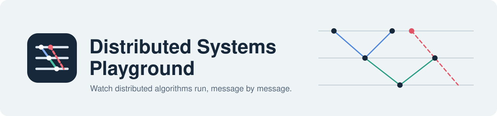
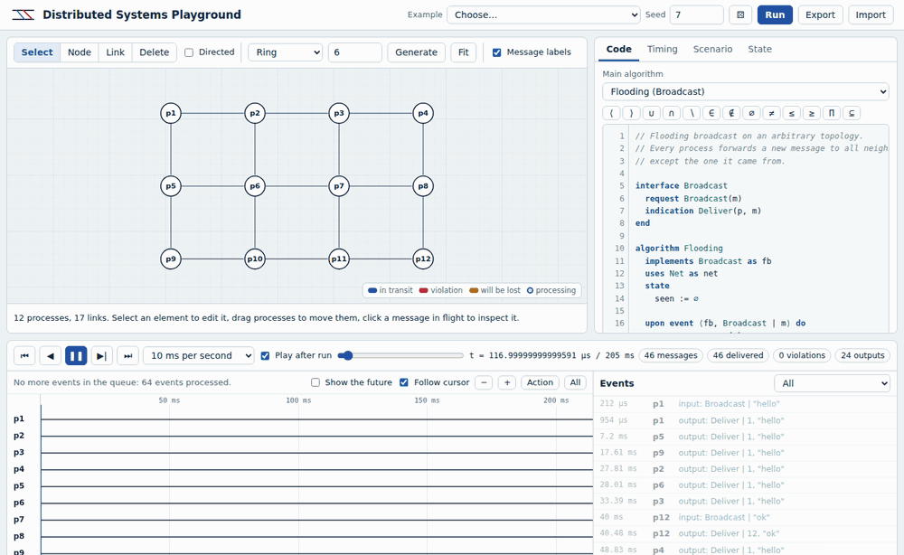
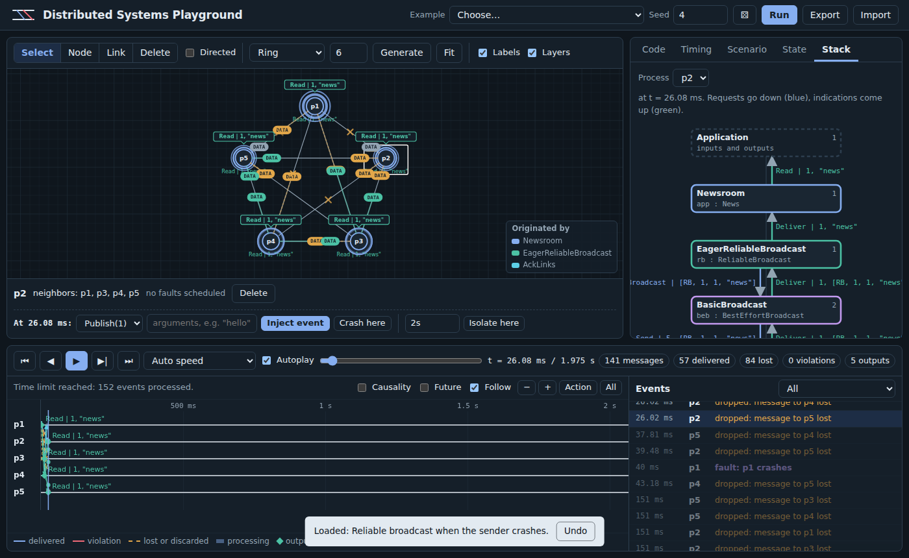
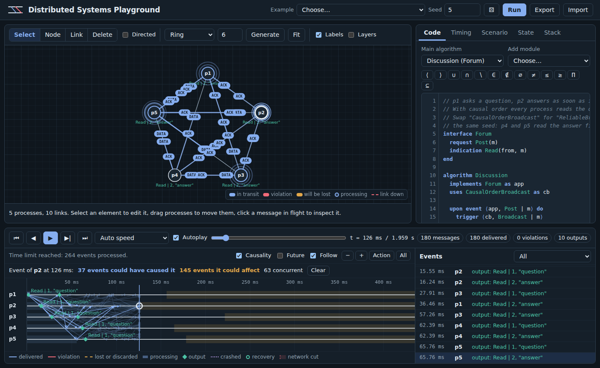
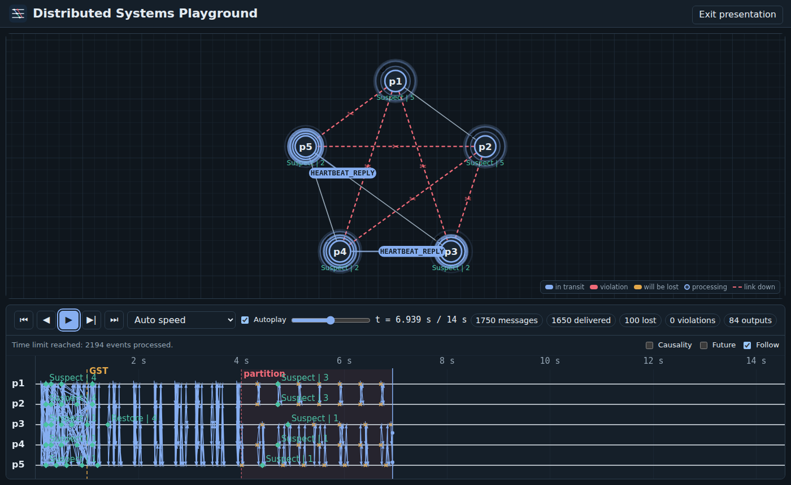
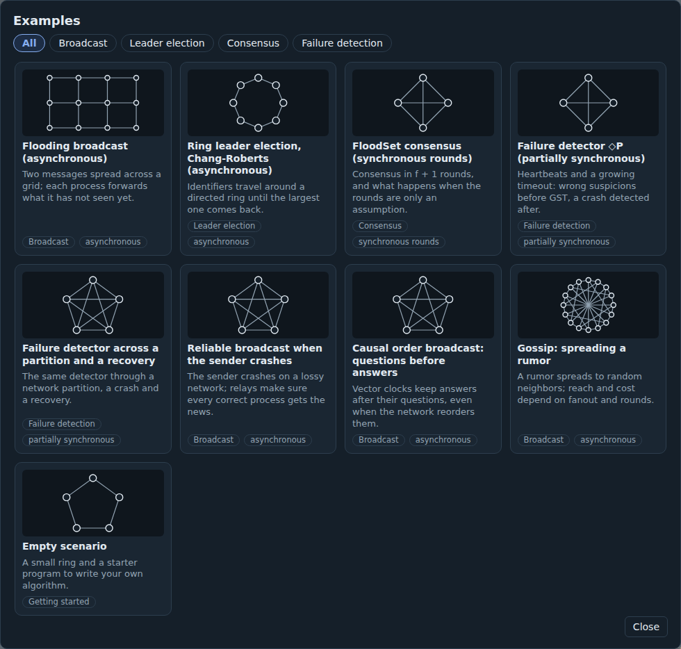

<div align="center">

<picture>
  <source media="(prefers-color-scheme: dark)" srcset="docs/assets/banner-dark.svg">
  
</picture>

# Distributed Systems Playground

**Watch distributed algorithms run, message by message, on the network you actually have.**

[](https://github.com/engineering87/distributed-systems-playground/actions/workflows/ci.yml)
[](LICENSE)

[](https://engineering87.github.io/distributed-systems-playground/)

[Live demo](https://engineering87.github.io/distributed-systems-playground/) · [Documentation site](https://engineering87.github.io/distributed-systems-playground/manual/) · [Getting started](docs/getting-started.md) · [Assumptions](docs/assumptions.md) · [Changelog](CHANGELOG.md)



</div>

Distributed Systems Playground is a browser-based environment for writing, running and observing distributed algorithms. You draw a network of processes, write an algorithm in the event-driven pseudocode used by the standard textbooks, and watch every message travel, arrive, get lost or arrive too late.

Its distinguishing idea is that the timing model the algorithm *assumes* and the way the network *actually behaves* are configured separately. Most algorithms are proved correct under assumptions that real networks do not honor. Here you can hold the assumptions fixed, change the network underneath, and see the exact message that breaks the algorithm.

Everything runs in the browser from a single HTML file. There is no server to deploy and nothing to install.

<table>
  <tr>
    <td width="50%"><br><sub><b>Stack view.</b> Requests go down, indications come up, messages are colored by the module that sent them.</sub></td>
    <td width="50%"><br><sub><b>Causality.</b> Click an event to shade what could have caused it and what it could affect.</sub></td>
  </tr>
  <tr>
    <td width="50%"><br><sub><b>Presentation mode.</b> Large text, no side panel, a clicker steps through events.</sub></td>
    <td width="50%"><br><sub><b>Example gallery.</b> Classic algorithms, each with experiments to try.</sub></td>
  </tr>
</table>

## What it is for

An algorithm is proved correct under assumptions: messages arrive within a bound, clocks agree, processes fail by
stopping. A real network keeps none of those promises, and the gap is where distributed systems break.

Here the two are separate settings. **What the algorithm assumes** about timing and **what the network actually
does** are configured apart, so you can run FloodSet under ideal synchronous rounds, watch every process decide the
same value, then keep the same code and the same seed, switch to rounds built on drifting clocks, and watch one
process decide differently. The algorithm did not change. Its assumption did.

Write the algorithm in the event-driven pseudocode of the textbooks, declare next to it the properties it should
satisfy, and let the playground check them after every step — in one run, or over hundreds of runs with faults drawn
at random.

```text
property Agreement always
  #toset(values(defined(decision))) ≤ 1
end
```

Ask whether it holds in general, and the answer is a table:

```text
      condition                Agreement     Validity  Termination   msgs  reach
  ok  no faults                    15/15        15/15        15/15     24   100%
 ~    one crash                    15/15        15/15        15/15   22.2    78%
 FAIL partitions 1.5/s             10/15        15/15        15/15     24   100%
```

## Quick start

**Online.** Open the [live demo](https://engineering87.github.io/distributed-systems-playground/). The flooding example loads and starts playing.

**Locally.** Clone the repository and open `index.html` in a recent version of Chrome, Edge, Firefox or Safari:

```sh
git clone https://github.com/engineering87/distributed-systems-playground.git
cd distributed-systems-playground
open index.html        # or double-click the file
```

Press `?` in the page for the keyboard shortcuts, or read them in [the interface guide](docs/interface.md#keyboard-shortcuts).

## Algorithms you can run

Every algorithm below ships as a scenario: the code in Upon, a topology, a timing model, the faults, and the properties it must satisfy, checked after every step. Open one from the *Gallery*, press Run, and change something.

| Algorithm | Model | What it shows | Properties checked |
|---|---|---|---|
| **Flooding broadcast** | asynchronous | a message spreads over an arbitrary graph, each process forwarding once | — |
| **Chang-Roberts election** | asynchronous | the largest identifier travels a directed ring and comes back | — |
| **FloodSet consensus** | synchronous rounds | consensus in f + 1 rounds, and what happens when the rounds are only an assumption | agreement, validity, termination |
| **Perfect failure detector (P)** | timed synchronous | with known bounds a missed heartbeat means a crash, and nobody correct is ever suspected | accuracy, completeness |
| **◇P failure detector** | partially synchronous | a growing timeout: wrong suspicions before GST, a crash detected after | — |
| **◇P through a partition** | partially synchronous | each side of a partition sees the other as crashed, then a crash and a recovery | — |
| **Ω, eventual leader** | partially synchronous | the churn before GST, and one correct leader afterwards, the same for everybody | eventual agreement on a correct leader |
| **Reliable broadcast** | asynchronous, lossy | the sender crashes mid-broadcast; relays save the message | — |
| **Causal order broadcast** | asynchronous, reordering | vector clocks keep answers after their questions | — |
| **Gossip** | asynchronous | a rumor over random neighbors: reach against cost | — |
| **Ricart-Agrawala mutual exclusion** | asynchronous | timestamps and deferred replies, with no coordinator | mutual exclusion |
| **Two-phase commit** | asynchronous | everybody commits together, and the participants block when the coordinator crashes in between | agreement, termination |
| **Logical clocks** | asynchronous | a Lamport counter and a vector clock side by side: what each one orders and what it refuses to order | own entry is highest, everybody ticks |
| **Chandy-Lamport snapshot** | asynchronous, FIFO | a consistent cut of a running system, and the coins that go missing as soon as channels stop being FIFO | conservation, snapshot once |
| **Majority-quorum register** | asynchronous | replication that survives a minority: safety under every fault, liveness only while a majority is reachable | reads are valid, operations return |
| **Total order broadcast** | asynchronous | one process decides the order and everybody follows, until that process crashes | total order, everybody delivers |
| **Paxos** | asynchronous | two proposers competing, majorities meeting, one value winning: agreement under every fault, termination only with a majority | agreement, validity, termination |
| **Ben-Or** | asynchronous | randomized consensus: when the processes cannot agree they toss a coin, and the decision changes with the seed | agreement, validity, termination |

Ten more algorithms come as **library modules** you can build on, written in the same language: stubborn, perfect and FIFO links, best-effort, reliable, uniform reliable, FIFO, causal and probabilistic broadcast. See [the module library](docs/library.md).

Each example is described in [Examples](docs/examples.md), with what to watch and experiments to try. To ask whether an algorithm holds in general rather than in one run, use the batch runs described in [the interface guide](docs/interface.md#batch-runs) or the [command line](docs/cli.md).

## What it does

**Writing**
- Event-driven pseudocode with interfaces, modules, guards, functions and the mathematical symbols of the books, in Unicode or ASCII.
- Completion and quick fixes built from the parse tree: instances, events with their arity, state, declare a missing variable, add a missing handler.
- A library of ten communication abstractions, from stubborn links to causal broadcast, added to your code in one click.

**Running**
- A deterministic engine: a seed and a link reproduce the exact run, message by message.
- Timing models from synchronous to asynchronous, with GST, clock drift, loss, duplication and long-tailed delays, chosen separately from what the algorithm assumes.
- Crashes, recoveries, pauses, omissions, link failures in one or both directions, partitions, and faults armed by a condition on the global state.

**Checking**
- Properties written next to the algorithm and checked after every step, with the instant and the process of the first violation.
- Batch runs over many seeds in background workers, with fault schedules drawn by count or by rate.
- Shrinking of a failing schedule to the faults that are actually needed.
- A behaviour profile over a grid of fault conditions, exportable as a Markdown report, and a suite saved in the scenario so that `dsp run scenario.json --suite` is a one-line check in continuous integration.

**Watching**
- A space-time diagram with processing bars, violations, outputs, rounds and GST, and a causality mode that shades what could have caused an event and what it could affect.
- A stack view that follows one message through the layers, with packets coloured by the module that sent them.
- Presentation mode, an example gallery, image export, light and dark themes, a colour-vision-deficiency palette, and an Italian interface.

A [guided tour](docs/tour.md) walks through seven of these in order.

## Documentation

The documentation goes further than this page. Read it on the [documentation site](https://engineering87.github.io/distributed-systems-playground/manual/), with navigation and search, or as Markdown in [`docs/`](docs/README.md):

| Page | What you will find |
|---|---|
| [Getting started](docs/getting-started.md) | a twenty-minute walkthrough: write an algorithm, break it, fix it |
| [Concepts](docs/concepts.md) | the theory behind the playground, with a glossary |
| [Examples](docs/examples.md) | every example, what to watch and what to try |
| [The interface](docs/interface.md) | every control and every mark on the screen |
| [The Upon language](docs/language.md) | the complete language reference |
| [The module library](docs/library.md) | each module, its messages, guarantees and costs |
| [The timing model](docs/timing-model.md) | assumed and actual models in detail |
| [Faults](docs/faults.md) | crashes, recoveries, link failures and partitions |
| [How the engine works](docs/engine.md) | event ordering, steps, determinism |
| [Assumptions and simplifications](docs/assumptions.md) | what the simulator leaves out, in one place |
| [Teaching with the playground](docs/teaching.md) | lesson advice and exercises |
| [Running scenarios outside the browser](docs/cli.md) | the command line tool and the batch runner API |
| [A guided tour](docs/tour.md) | seven scenarios in order, each showing one thing the playground is for |
| [Questions, related tools, references](docs/faq.md) | what it is and is not, how it compares, what to read |
| [Troubleshooting](docs/troubleshooting.md) | symptoms, causes and fixes |

The Upon programs in the documentation are compiled by the test suite, and the results quoted come from real runs with the stated seeds.

## Development

### Project layout

```
src/
  core.js          lexer, parser, checker, interpreter, engine, causal cone (no DOM)
  runner.js        batch runs over many seeds, used by the command line and the tests
  library.js       communication modules written in Upon
  i18n.js          Italian translation of the interface
  examples.js      example scenarios and timing presets
  ui/              the interface, one file per area (state, forms, editor, topology,
                   results, diagram, playback, log, preview, scenarios, images,
                   settings, startup), concatenated into one scope at build time
  style.css        light and dark themes
  template.html    page structure
bin/dsp.mjs        command line tool: run and check scenarios without a browser
scripts/build.mjs  bundles src/ into index.html
scripts/build-docs.mjs  generates the documentation site in manual/
test/              Node tests: engine, runner, language, guards, documentation
test/browser/      Playwright suites for the interface, one file per area
docs/              specification and README media
index.html         generated, self-contained application
manual/            generated documentation site
```

### Commands

Requires Node.js 18 or later. There are no dependencies to install.

```sh
npm test         # engine, library, language, guards, documentation
npm run test:browser   # the interface, with Playwright (pip install playwright)
npx distributed-systems-playground profile --example paxos      # from npm, without cloning
npm run dsp -- run --example floodset --seeds 1..8 --outcomes   # run scenarios from a terminal
npm run build    # rebuild index.html and the documentation site
npm run check    # fail if index.html or manual/ is out of date
```

`index.html` and `manual/` are build outputs, but they are committed so that GitHub Pages can serve the repository root directly: the playground at `/` and the documentation at `/manual/`. Rebuild them before committing changes to `src/` or `docs/`.

### Tests

The suite covers the language (including functions, `via` and the built-ins), every library module under loss, reordering and crashes, every example, the determinism of traces, the correctness properties of each example (for instance, Chang-Roberts elects the highest identifier and ◇P ends up suspecting exactly the crashed process), the static checks, the ASCII syntax, crash-recovery with `stable` state, link failures and partitions, fault validation, and the guarantee that injecting an event or a fault does not alter earlier history.

### Continuous integration and deployment

The GitHub Actions workflow runs the tests and verifies that `index.html` matches the sources. To publish the demo, enable GitHub Pages under *Settings → Pages → Deploy from a branch → main / root*.

## Contributing

Issues and pull requests are welcome. Useful contributions include:

- **New examples.** Add the scenario to `src/examples.js` and a test in `test/core.test.cjs` that checks the property the algorithm guarantees.
- **Language and engine features.** Keep `src/core.js` free of DOM access, so that it stays testable under Node.
- **Interface improvements.** Check both themes and a narrow viewport.
- **Documentation.** Keep it exact: quote only results obtained from the engine, and state the seed.

The workflow and the writing guidelines are in [CONTRIBUTING.md](CONTRIBUTING.md). Before opening a pull request, run:

```sh
npm test && npm run build && npm run check && npm run test:browser
```

## Citing

If you use the playground in a course or a paper, GitHub's *Cite this repository* button gives a ready-made reference from [CITATION.cff](CITATION.cff).

## License

Released under the [MIT License](LICENSE). © Francesco Del Re
